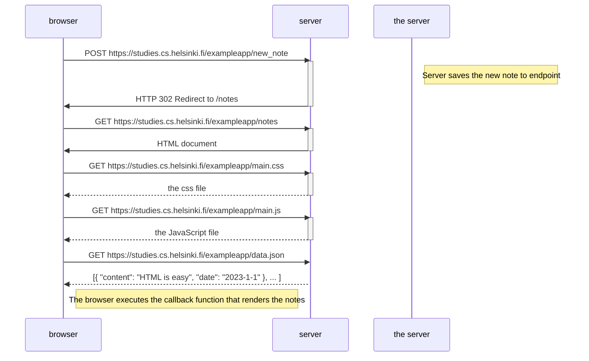

```mermaid
sequenceDiagram
    participant browser
    participant server

    browser->> server: POST https://studies.cs.helsinki.fi/exampleapp/new_note
    activate server
    Note right of the server: Server saves the new note to endpoint
    server->> browser: HTTP 302 Redirect to /notes
    deactivate server

    browser->> server: GET https://studies.cs.helsinki.fi/exampleapp/notes
    activate server
    server->> browser: HTML document
    deactivate server

    browser->>server: GET https://studies.cs.helsinki.fi/exampleapp/main.css
    activate server
    server-->>browser: the css file
    deactivate server

    browser->>server: GET https://studies.cs.helsinki.fi/exampleapp/main.js
    activate server
    server-->>browser: the JavaScript file
    deactivate server

    browser->>server: GET https://studies.cs.helsinki.fi/exampleapp/data.json
    activate server
    server-->>browser: [{ "content": "HTML is easy", "date": "2023-1-1" }, ... ]

    Note right of browser: The browser executes the callback function that renders the notes
```
