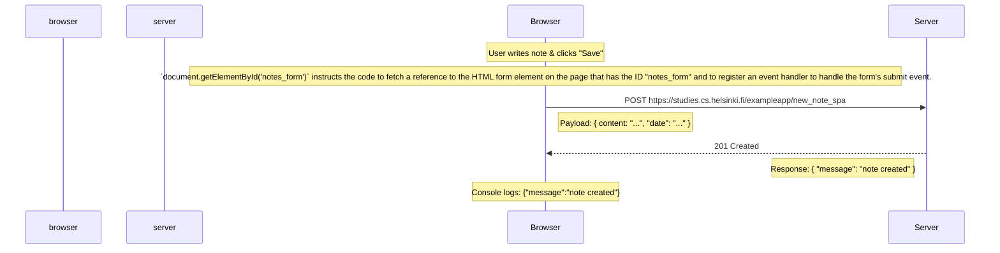

```mermaid
sequenceDiagram
    participant browser
    participant server

    Note over Browser: User writes note & clicks "Save"
    Note over Browser: `document.getElementById('notes_form')` instructs the code to fetch a reference to the HTML form element on the page that has the ID "notes_form" and to register an event handler to handle the form's submit event.

    Browser->>Server: POST https://studies.cs.helsinki.fi/exampleapp/new_note_spa
    Note right of Browser: Payload: { content: "...", "date": "..." }

    Server-->>Browser: 201 Created
    Note left of Server: Response: { "message": "note created" }

    Note over Browser: Console logs: {"message":"note created"}

```
